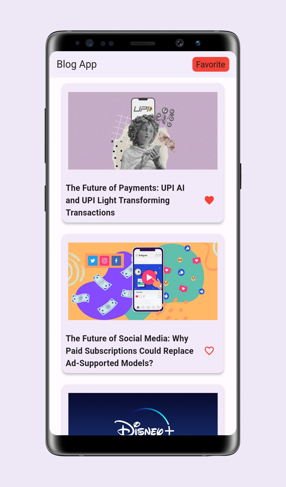
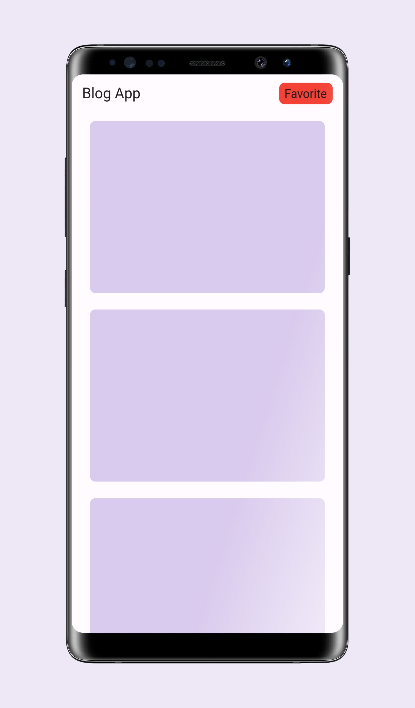
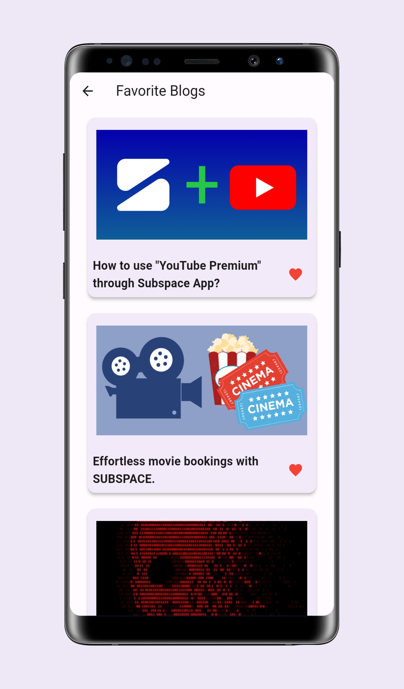
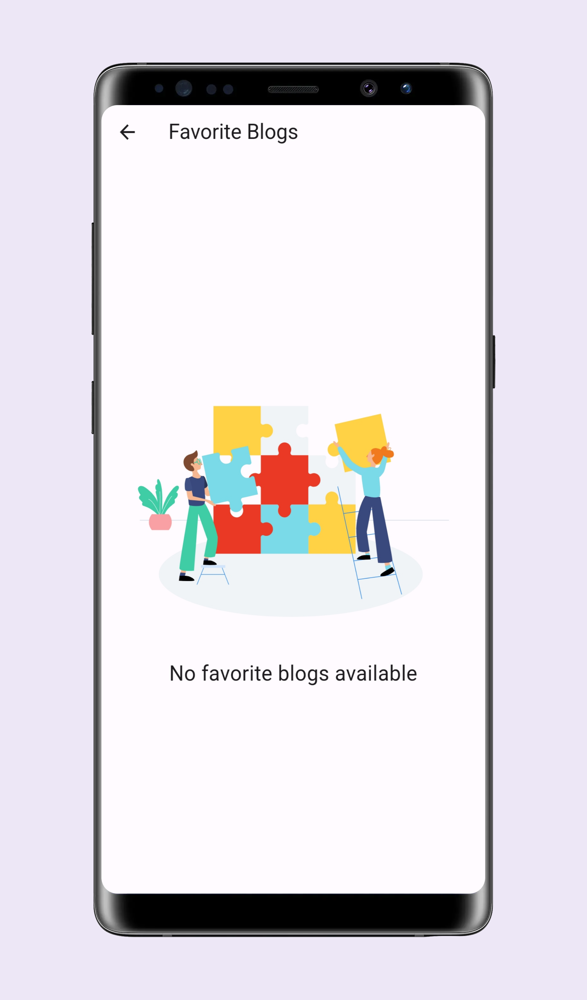

# Blog App

Blog App is a Flutter application that allows you to explore and engage with a list of blogs fetched from a RESTful API. You can view blog details, mark blogs as favorites, and also you can view and interact with blogs in offline mode.


## Setup

Before you start, make sure you have the following software installed on your system:

* Flutter SDK
* Dart
* Visual Studio Code or Android Studio
### Installation

1. Clone this repository to your local machine:


```bash
git clone https://github.com/suyog73/Blog-App.git
```

2. Navigate to the project directory:


```bash
cd Blog-App
```

3. Create a .env file in the root directory of your Flutter project.


```bash
BASE_URL=https://api.example.com 
API_HEADER=your_api_header_here
```


4. Install dependencies using flutter pub get:


```bash
flutter pub get
```

5. Run the app on your preferred emulator or connected device:


```bash
flutter run
```
# Download

Download Link:- [https://drive.google.com/file/d/19gA2Fm6xPHApqutiQIF6fj5XgX5xn6ke/view?usp=sharing](https://drive.google.com/file/d/19gA2Fm6xPHApqutiQIF6fj5XgX5xn6ke/view?usp=sharing)

# Screenshots

### Home Screen

Landing Page (All Blogs) | Loading Blogs Page
<p align="center">


</p>

### Favorite Screen

Favorite Page (Favorite Blogs) | No Favorite Blogs Page
<p align="center">


</p>
